# HONOR ViewPad 7 Pro (BRT-W09)


## Device Info


- **SoC**: MediaTek Kompanio 1300T
- **GPU**: Mali G77 MC9
- **OS**: Android 12


## MobileGlues version tested

1.1.0.1


## Mod compatibility


|**Mod**|**Status**|
|---|---|
| Sodium | ✅(0.6.10) |
| Iris | ✅(1.8.8) |
| Xaero's Minimap | ✅(25.1.0) |
| Xaero's World Map | ✅(1.39.4) |
| ModernUI | *️⃣(3.11.1.11) |


## Shaderpack compatibility


|**Shaderpack** | **ShaderLoader** | **Status** |
|---|---|----|
| BSL | Iris | *️⃣(8.4.02.2, low)(~20fps) |
| BSLClassic | Iris | ✅(8.4.02.2, Low)(~30fps) |
| Lux | Iris | ✅(v1.1, Low)(10fps) |
| Photon | Iris | *️⃣(v1.1, High)(bellow 10fps)(Render error)(unplayable) |
| Chocapic13 V9 | Iris | ❎(failed to load) |
| Chocapic13 HighPerformance | Iris | ❎(always white screen) |
| RedHat | Iris | *️⃣(v34.3, Low)(10~14fps)(Render issue) |
| MakeUp-UltraFast | Iris | ✅(9.1c)(bellow 20fps,Low profile) |
| Complementary Reimagined | Iris | ❎(r5.4)(can not load)(with log) |
| Complementary Unbound | Iris | ❎(r5.4)(can not load)(with log) |
| Kappa | Iris | *️⃣(v5.3)(bellow 10fps)(Render error)(unplayable) |
| PotatoShaders | Iris | *️⃣(v1.0d)(18~30fps)(Render issue) |
| Tea | Iris | *️⃣(v2.0.0-dev7)(semi-solid 30fps)(Render issue) |


## Notes

### ModernUI:

1. Works fine but have a major performance <!--Genshin--> impact.
2. Can't load a lot of fonts which causes log spam.

### BSL Shader

Cloud&shadow error

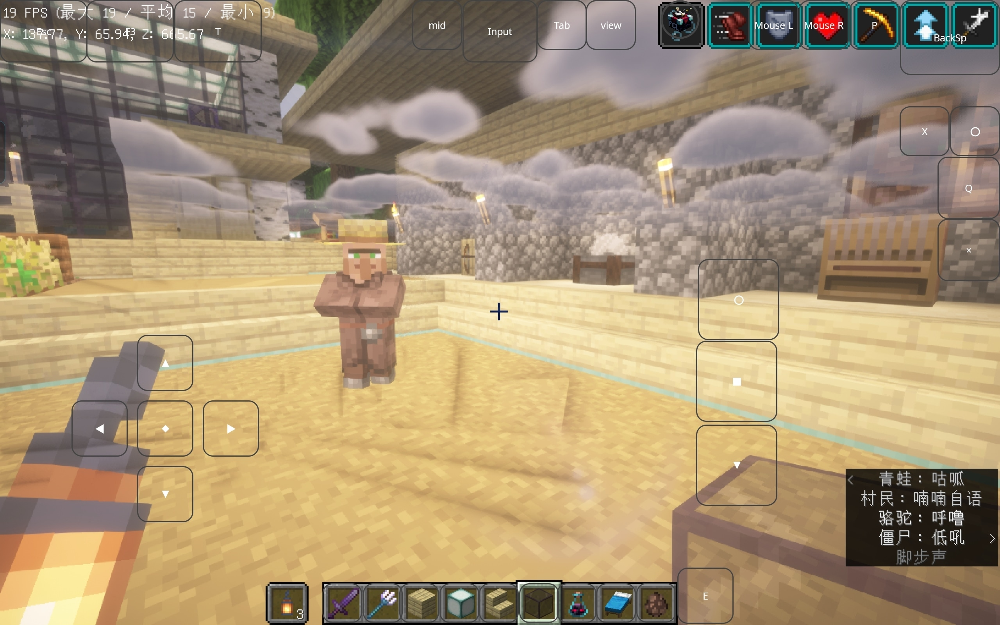

### BSL Classic

Shadow error


### Photon

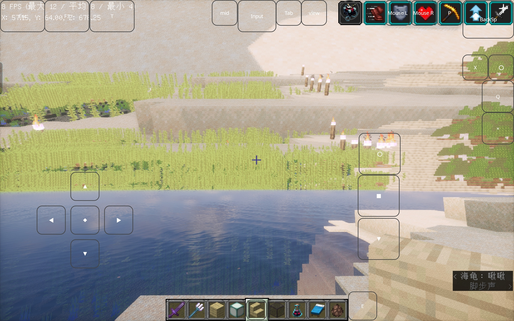

*Are U playing a Sci-fi game?*

### RedHat

1. double cloud

   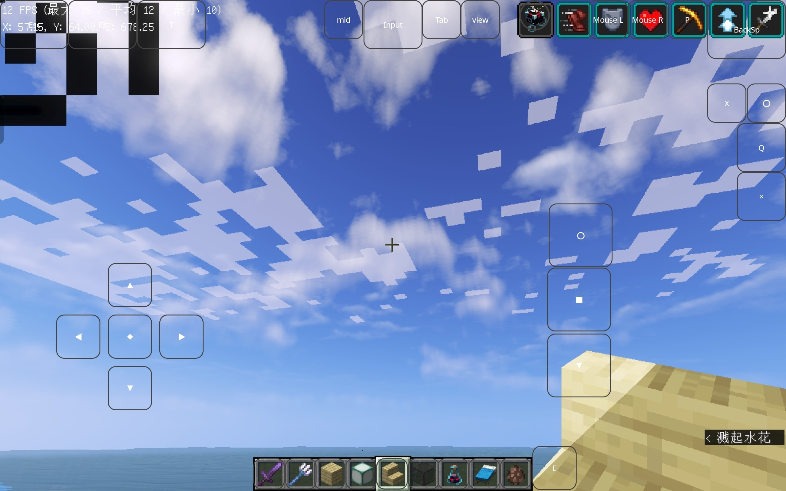

2. selective-transparent glass

   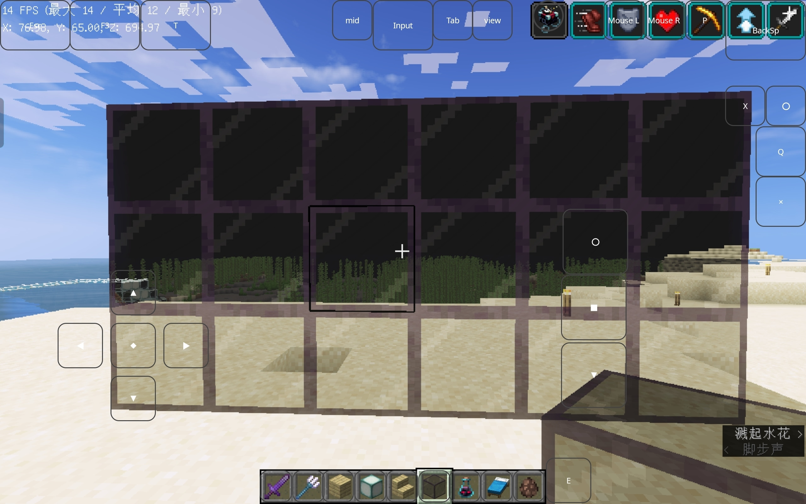

   *but it deserves her name:"tinted glass"*

3.


4. RedHat Enterprise Linux

### Complementary Reimagined r5.4 & Complementary Unbound r 5.4

```glsl
deferred1.vsh: deferred1.vsh: 0:2: P0003: Extension 'GL_NV_shader_noperspective_interpolation' not supported
0:116: L0003: Keyword 'noperspective' is reserved
```

### Kappa

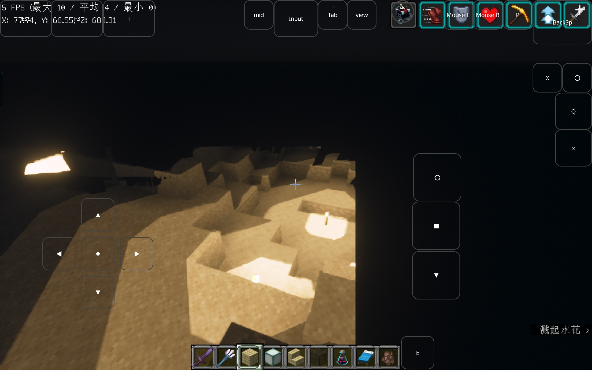

*Sir, I'm afraid you have limited eyesight.*

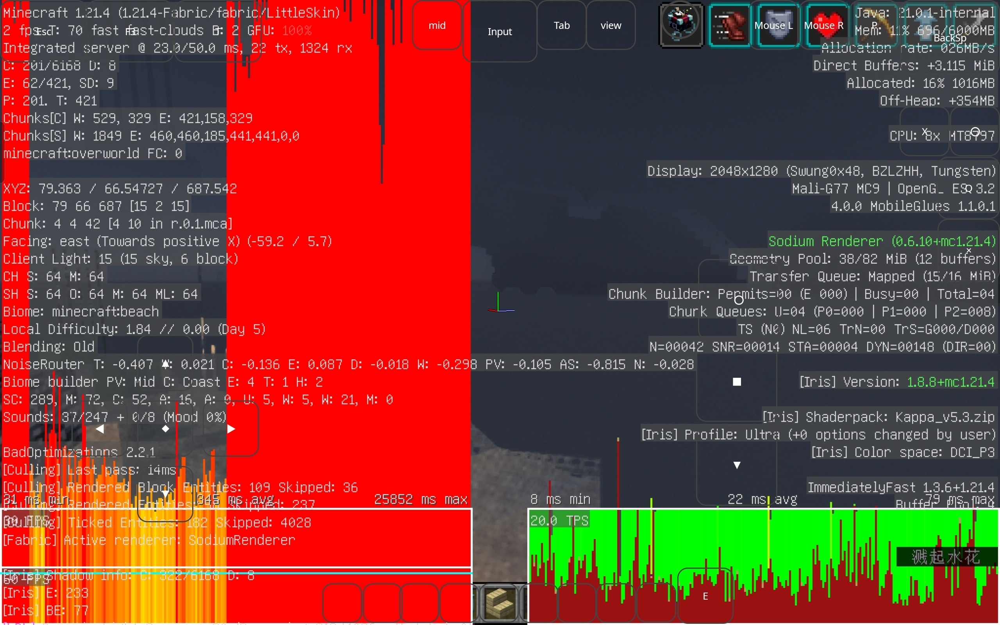

*MC Projekt Red*

### PotatoShader

1. 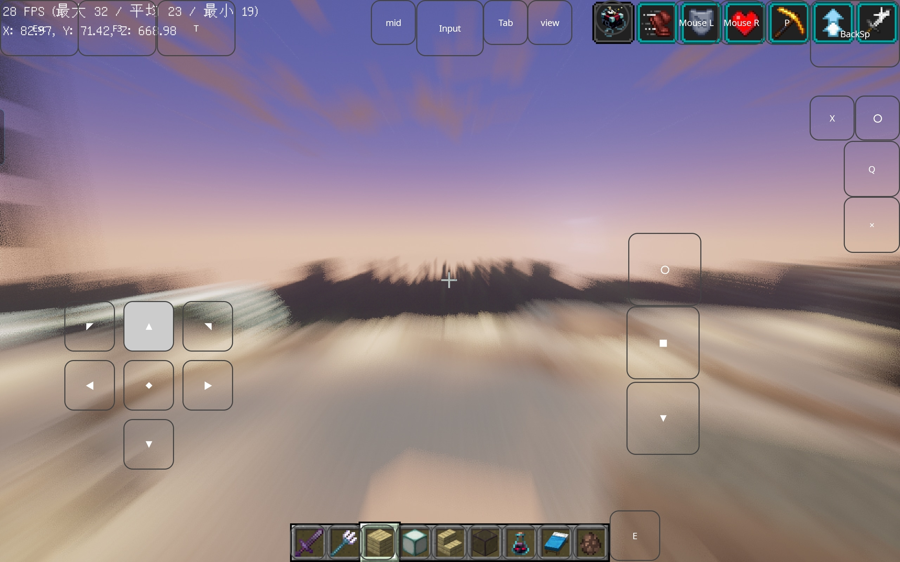

​	*胜ち取りたいものもない*

<iframe frameborder="no" border="0" marginwidth="0" marginheight="0" width=330 height=86 src="//music.163.com/outchain/player?type=2&id=513363028&auto=1&height=66"></iframe>

2. random reflection <!--NVIDIA Reflex-->

   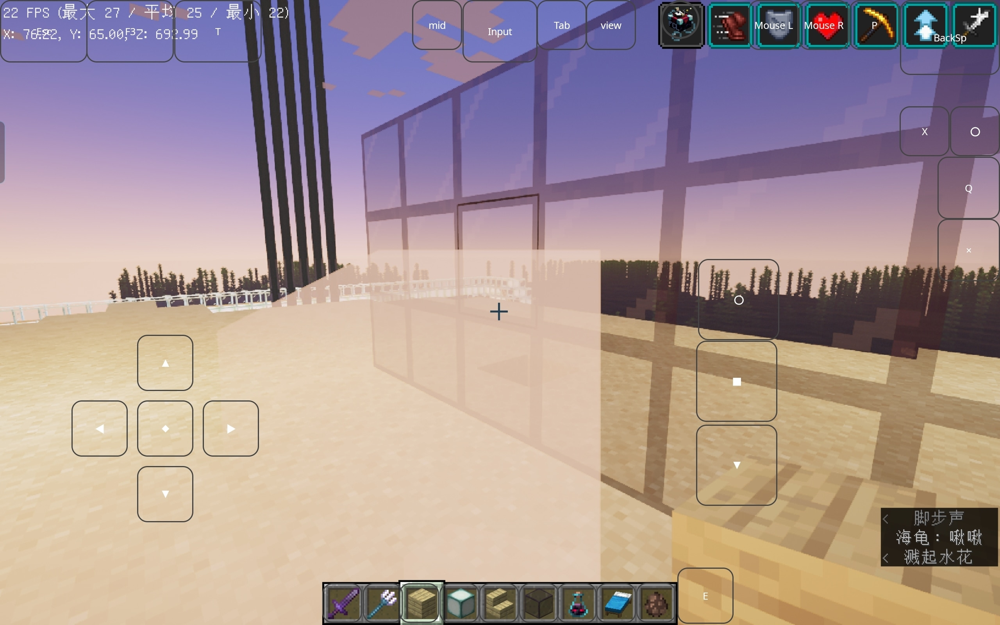

3. Limited eyesight
   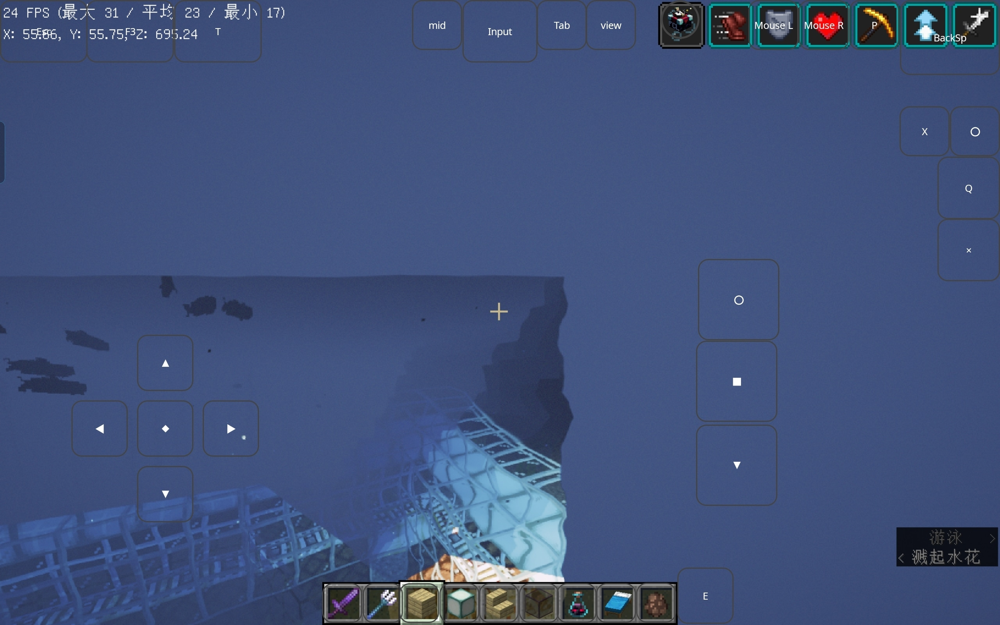

4. [There Must Something in the water](https://music.163.com/#/song?id=1834260605)

   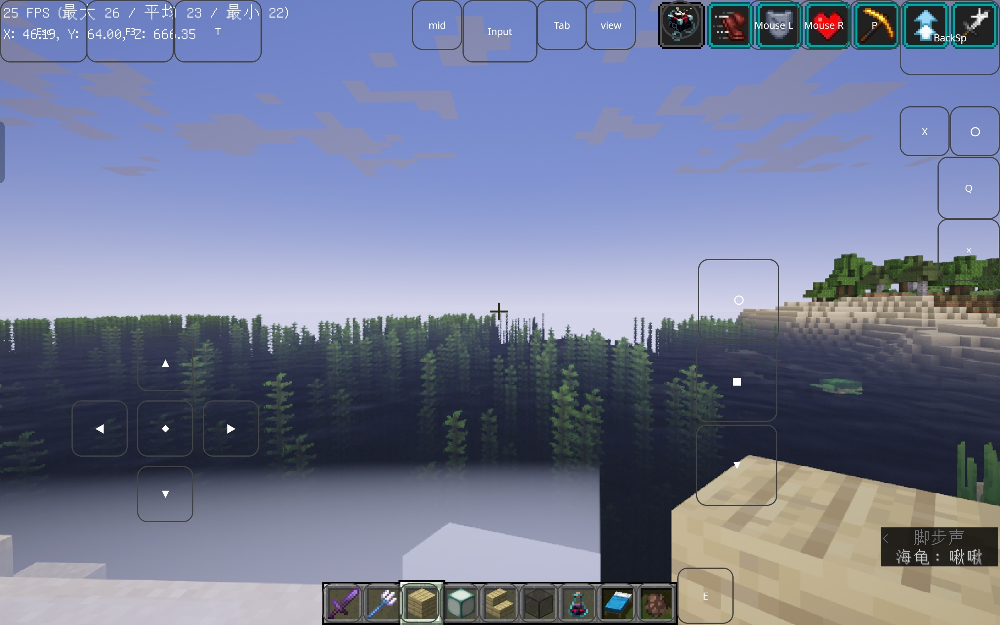

### Tea

*It supposed to be a vanilla-like shader plus extra tweaks*

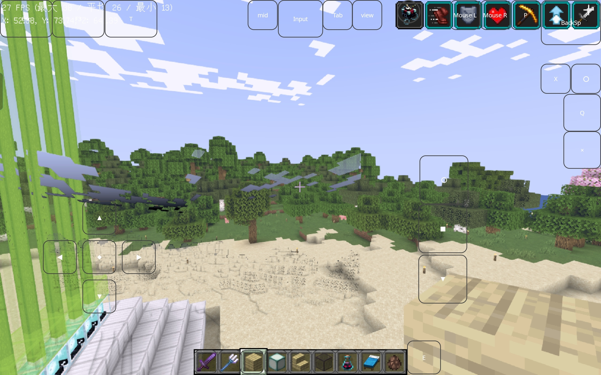

<!--Femboy Swung0x48-->

<!--Femboy Swung0x48-->

<!--Femboy Swung0x48-->